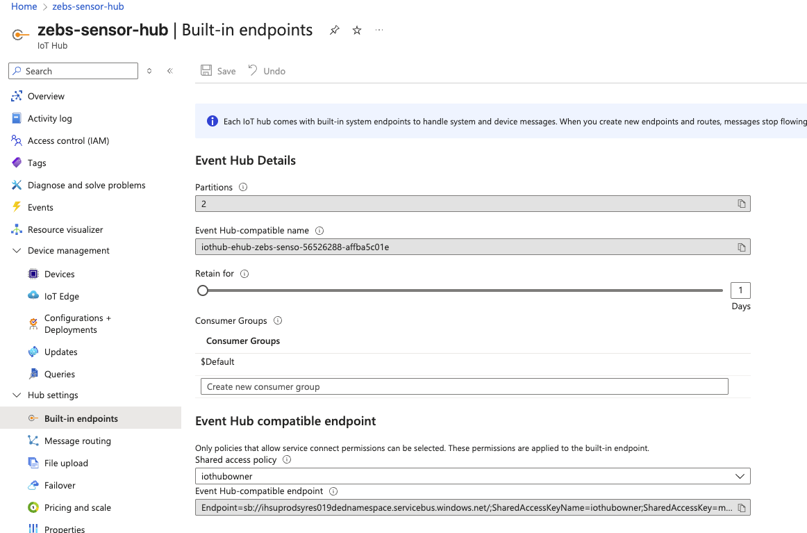
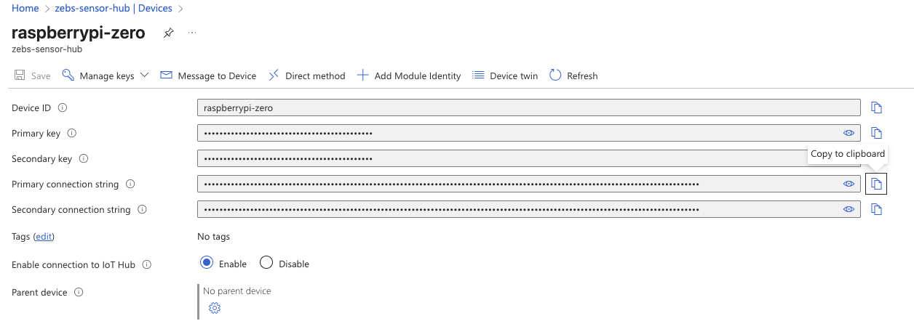
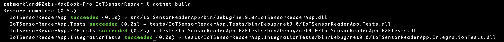
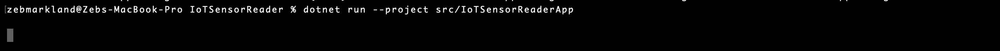
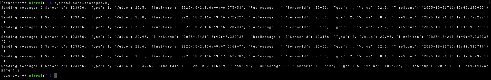
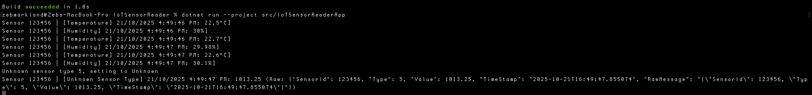
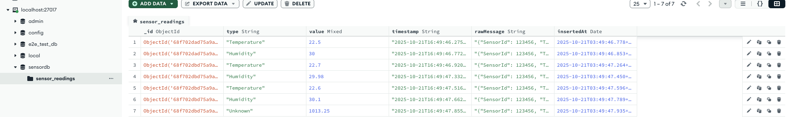

# IoT Sensor Reader App
## Project Overview


## Overview of Technologies Used
- Raspberry Pi Zero (acts as IoT device)
	- Raspberry Pi OS Lite
	- Python scripts to simulate sensor readings
- Azure IoT Hub
- .NET 9.0 Application
- MongoDB for DB Output

## Application Components Overview 

### Configuration 

### Messaging 

### Proccessing

### Models

### Formatting

### Output


## End-to-End Message Process

Tracing two messages from IoT device (Raspberry Pi) through to Application outputs (console + MongoDB)

### Step 1. IoT Device Sends Message
For this example the IoT Device will send 2 messages - one of Temperature type and one of Humidity Type

```
{
	"SensorId": 123456,
	"Type": 1,
	"Value": 22.5,
	"Timestamp": "2025-10-20T14:30:00.123456"
	"RawMessage": "{...}"
}

{
	"SensorId": 123456,
	"Type": 2,
	"Value": 60.0,
	"Timestamp": "2025-10-20T14:30:00.123456"
	"RawMessage": "{...}"
}

{
	"SensorId": 123456,
	"Type": 5,
	"Value": 1013.25
	"Timestamp": "2025-10-20T14:30:00.123456"
	"RawMessage": "{...}"
}
```
**Component**: Raspberry Pi (data simulated by a python script)
**Action**: Sends JSON message to Azure IoT Hub


### Step 2. Azure IoT Hub Receives and Routes Message


### Step 3. EventHub Stores Message


### Step 4. EventHubConsumer Reads Message


### Step 5. MessageCoordinator Delegates

**Component**: MessageCoordinator.cs

**Action**:
	- Consumes messages from EventHubConsumer
	- Delegates conversion to JsonMessageDeserializer 
	- Passes deserialized object to MessageProcessor


**Dependencies:** IEventHubConsumer, IMessageDeserializer, IMessageProcessor


### Step 6. JsonMessageDeserializer Converts

**Component**: JsonMessageDeserializer.cs

**Action**:
	- Takes raw Json message
	- Deserializes Json message and returns a SensorReading Object

### Step. 7 SensorMessageProcessor Selects Strategy for each Message 

**Component**: MessageProcessor.cs 

**Action**:
	- Selects appropriate Handler for SensorReading
	- Delegates processing of each reading to Handler 
	- Passes SensorReading to CompositeOutputService 


**Dependencies:** List\<SensorHandler>, IOutputService 

### Step 8. Handlers Process Readings

**Note:** This is currently "redundant code" but has been retained to demonstrate where the entry point for additional business logic, such as calculations, alerting etc, would be.


### Step 9. CompositeOutputService Distributes

**Component**: CompositeOutputService.cs

**Action:** 
- Receives SensorReading from MessageProcessor which treats it as a single outputservice
- Distributes to all registered output services


**Dependencies:** a Collection of IOutputService

### Step 10a. ConsoleOutputService 

**Component**: CompositeOutputService.cs

**Action:** 
- Recieves SensorReading
- Selects the correct formatter based on ReadingType
- Delegates Formatting to the chosen Formatter which returns human readable string
- Writes the formatted output to Console


**Example Console Outputs:**
```
Sensor 123456 | [Temperature] 20/10/2025 2:30:00 PM: 22.5
Sensor 123456 | [Humidity] 20/10/2025 2:30:00 PM: 60.0
Unknown sensor type 5, setting to Unknown
Sensor 123456 | [Unknown Sensor Type] 20/10/2025 2:30:00 PM: 1013.25 (Raw: {"SensorId": 123456, "Type": 5, "Value": 1013.25, "TimeStamp": "2025-10-20T14:30:00.123456", "RawMessage": "{...}"})
```

**Dependencies:** a Collection of ISensorFormatter

### Step 10b. DbOutputService

**Component**: CompositeOutputService.cs

**Action:** 
- Receives SensorReading
- Delegates Formatting to JsonSensorFormatter
- Creates a MongoDB Document and Inserts it into MongoDB

**Example MongoDB Documents:**
```
{
	"_id": ObjectID("..."),
	"type": "Temperature",
	"value": 22.5,
	"timestamp": "2025-10-20T14:30:00.123Z",
	"rawMessage": "{...}",
	"insertedAt": "2025-10-20T14:30:00.789Z"
}

{
	"_id": ObjectID("..."),
	"type": "Humidity",
	"value": 60.0,
	"timestamp": "2025-10-20T14:30:00.123Z",
	"rawMessage": "{...}",
	"insertedAt": "2025-10-20T14:30:00.789Z"
}

{
	"_id": ObjectID("..."),
	"type": "Humidity",
	"value": 1013.25,
	"timestamp": "2025-10-20T14:30:00.123Z",
	"rawMessage": "{...}",
	"insertedAt": "2025-10-20T14:30:00.789Z"
}
```

**Dependencies:** a Collection of ISensorFormatter


## Example of Application Running

The following is a brief, high level, example of the application running to demonstrate outputs. 
Assuming that the following setup has been completed:

An Azure IoT Hub has been deployed and the raspberry pi device registered. 
With the EventHub compatiable connection string being added to applications enviroment variables:


The Raspberry Pi has been set up with an OS and provided the python sensor data script (send_messages.py): 


And the device connection string added to the raspberry pi env variables for the script to connect:


**Step 1. Build the .Net Application** 


**Step 2. Run the .Net Application** 


**Step 3. Send Sensor data from Raspberry Pi device** 


**Results** 
**Console Output:** 

**MongoDB documents:** 



# Testing 

This project utilized the following testing types
- Unit testing
- Integration testing
- End-to-end testing